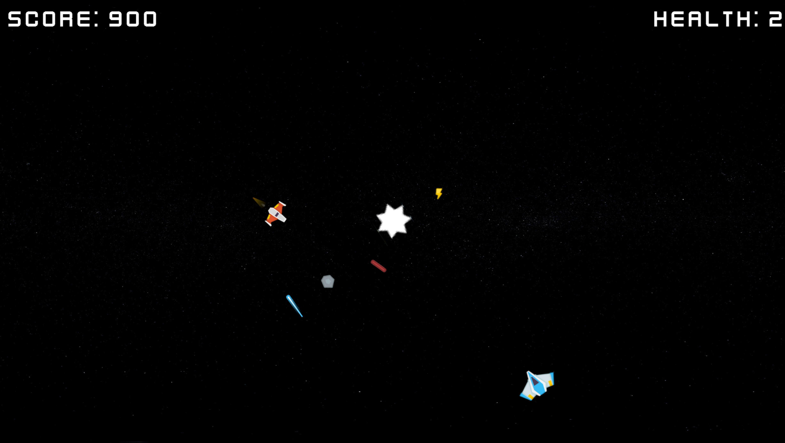
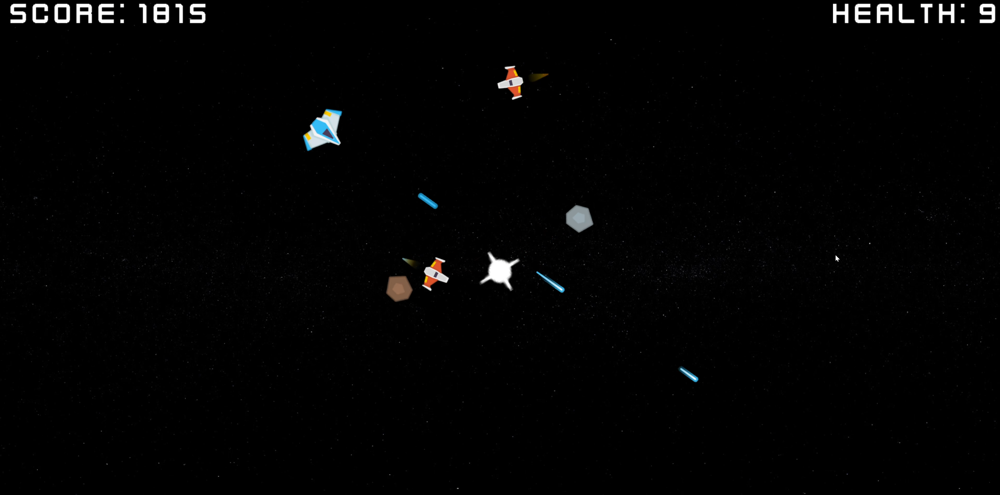
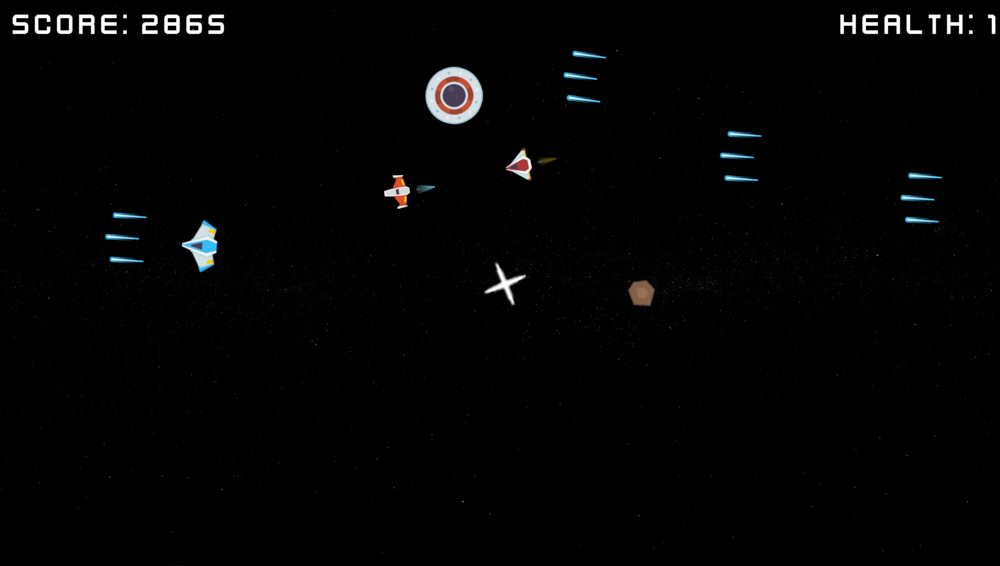
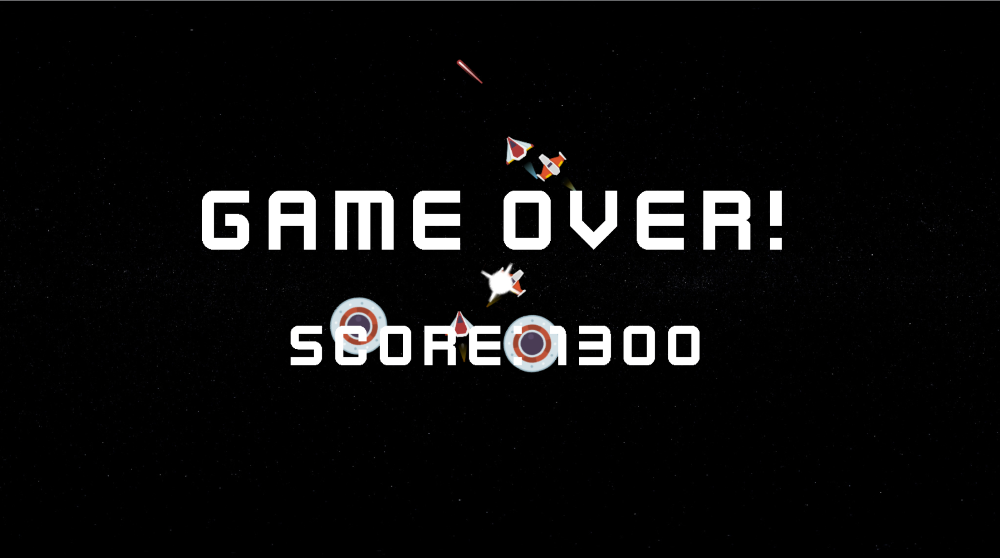

# SpacewarSDL
Spacewar  game remake on SDL2
With addition of enemies
 
## Getting Started
Visual Studio 2022 is recommended

<ins>**1. Downloading the repository:**</ins>

Start by cloning the repository with `git clone https://github.com/Noardewyn/SpaceWarSDL.git`.

<ins>**2. Project configuration:**</ins>
   
Run the install.bat to generate visual studio solution

## Screenshots

